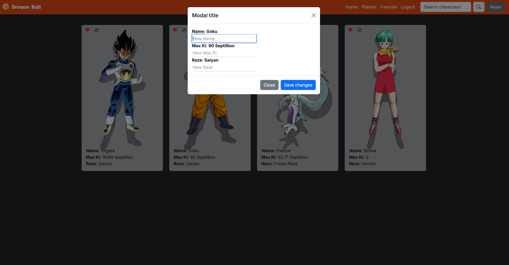

# Dragon Ball

Este proyecto es una aplicación web desarrollada con Vue 3 y Vite, que permite a los usuarios buscar y gestionar personajes y planetas del universo Dragon Ball. La aplicación incluye funcionalidades de autenticación, búsqueda, favoritos y más.

## Vista Previa




## Estructura del Proyecto

env .gitignore .vscode/ extensions.json settings.json index.html jsconfig.json main.js package.json public/ README.md src/ App.vue assets/ base.css main.css components/ tests/ ... CardCharacter.vue CardPlanet.vue icons/ Fav.vue LoginForm.vue NavBar.vue RegisterForm.vue core/ apis/ models/ repository/ router/ index.js stores/ AuthStore.js CharactersStore.js views/ FavoriteView.vue HomeView.vue PlanetsView.vue vite.config.js vitest.config.js

## Funcionalidades

- **Autenticación**: Los usuarios pueden registrarse, iniciar sesión y cerrar sesión.
- **Búsqueda**: Los usuarios pueden buscar personajes y planetas por nombre.
- **Favoritos**: Los usuarios pueden añadir personajes a su lista de favoritos.
- **Paginación**: Los resultados de búsqueda están paginados para una mejor experiencia de usuario.

## Requisitos del Sistema

- Node.js v14 o superior
- npm v6 o superior

## Configuración del Proyecto

### Instalación

1. Clona el repositorio:

```sh
git clone https://github.com/PabloA1A/DragonBall
cd dragonball
`````

2. Instala las dependencias:

```sh
npm install
````

### Variables de Entorno

Crea un archivo .env en la raíz del proyecto y configura las siguientes variables:

```sh
VITE_API_ENDPOINT_CHARACTERS=https://api.example.com/characters
VITE_API_ENDPOINT_PLANETS=https://api.example.com/planets
`````

### Compilar y Recargar en Caliente para Desarrollo

```sh
npm run dev
````

### Compilar y Minificar para Producción

```sh
npm run build
````

### Ejecutar Pruebas Unitarias con Vitest

```sh
npm run test:unit
````

### Estructura del Código

src/
- **App.vue**: Componente raíz de la aplicación.
- **assets/**: Archivos CSS y otros recursos estáticos.
- **components/**: Componentes reutilizables como `CardCharacter.vue`, `CardPlanet.vue`, `LoginForm.vue`, `NavBar.vue`, `RegisterForm.vue`.
- **core/**: Contiene la lógica de negocio y servicios API.
  - **apis/**: Servicios para interactuar con APIs externas.
  - **models/**: Modelos de datos.
  - **repository/**: Repositorios para manejar la lógica de datos.
- **router/**: Configuración de las rutas de la aplicación.
- **stores/**: Tiendas de estado global usando Pinia.
  - **AuthStore.js**: Maneja la autenticación de usuarios.
  - **CharactersStore.js**: Maneja los datos de personajes y planetas.
- **views/**: Vistas principales de la aplicación como `FavoriteView.vue`, `HomeView.vue`, `PlanetsView.vue`.

### Contribuir

Si deseas contribuir a este proyecto, por favor sigue los siguientes pasos:

1. Haz un fork del repositorio.
2. Crea una nueva rama (git checkout -b feature/nueva-funcionalidad).
3. Realiza tus cambios y haz commit (git commit -am 'Añadir nueva funcionalidad').
4. Sube tus cambios a tu fork (git push origin feature/nueva-funcionalidad).
5. Crea un Pull Request.

### Licencia

Este proyecto está licenciado bajo la Licencia MIT. Consulta el archivo LICENSE para más detalles.

### Contacto

Para cualquier consulta o sugerencia, por favor contacta a pablo_abadalvarez@hotmail.es

¡Gracias por usar Dragon Ball! Esperamos que disfrutes de la aplicación.